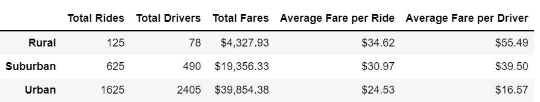
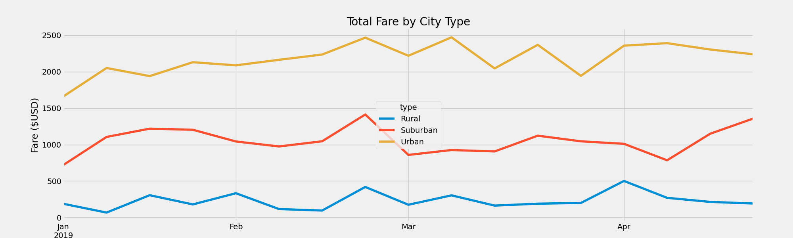

# PyBer_Analysis

## Overview of the analysis
- Create a summary DataFrame of the ride-sharing data by city type
- Create a multiple-line graph that shows the total weekly fares for each city type
- Use the above data and visualizations to analyze how the data differs by city type and how those differences can be used to improve PyBer.

## Results
Below is the summary table of the ride-sharing data by city type (urban, suburban, and rural).

From this table, we can see there is a positive correlation between total rides, total drivers, total fares, and population density. But the average fare per ride and average fare per driver are inversely correlated to population density. 

The following line chart displays the differences in weekly fare totals by city type.

As the chart shows, there was a lull in total sales for the early weeks of January. There was an uptick in sales for the week ending on 02/24/2019. Across the chart, there are more urban sales than suburban and rural combined.	

## Summary
Here are some recommendations from the data team:
- Let's examine the week ending on 2/24/2019 closer. Why was there an increase in sales that week? And how can we apply that to other weeks in the future?
- While urban cities have the highest fare totals, they also have the lowest average fare per ride. How can urban trips be lengthened? Perhaps multiple-stop rides could be marketed. For example, stopping by the convenience store or picking up dinner on the way home.
- There isn't any spike in sales for holidays like New Year's, Valentine's, or St. Patrick's Day. Ride share services should be in high demand for holiday revelers.